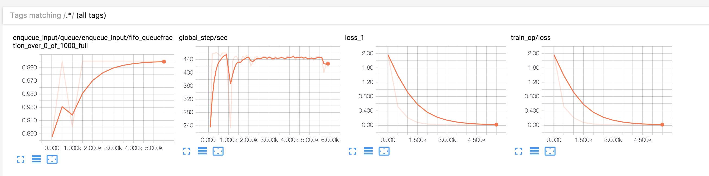
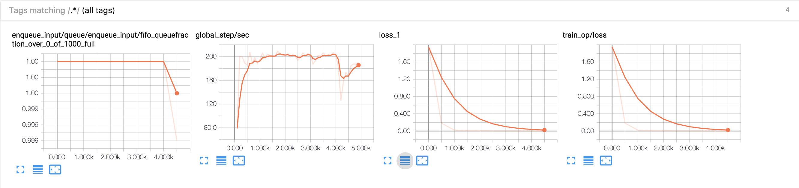

# Tensorflow tf_stack_bidirectional_rnn tutorial

# Tensorflow estimator tutorial

TensorFLow Sequence-to-Sequence Models for Conversation

# compare with simple dynamic rnn
## simple_dynamic_rnn
> 
## stack_bidirectional_rnn
> 
## Requirements

- Python 3.6
- TensorFlow 1.4

## Reference

- [stack_bidirectional_rnn](https://www.tensorflow.org/api_docs/python/tf/contrib/rnn/stack_bidirectional_rnn) - Tensorflow
- [dynamic_rnn](https://www.tensorflow.org/versions/r1.3/api_docs/python/tf/nn/dynamic_rnn) - Tensorflow

## Author
junbeomlee

